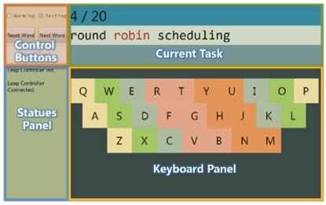

<head>
	<link href="../static/drcustom.css" rel="stylesheet" type="text/css">
</head>

<h2 class="P-title">ATK: Air Typing Keyborad</h3>

<!--Overview-->
<h4 class="P-subtitle">Project Overview</h4>
ATK (Air Typing Keyboard) is a novel air-typing system, which enables you to type in the air without wearing extra devices. Leapmotion was set to track fingers, with the tracked points' motion history, we can infer the typing words with an improved Bayes prediction model and language model.

<ul class="P-list">
<li> 2014.10 - 2015.4</li>
<li>Persuasive Computing Group, HCI Lab, Tsinghua University</li>
<li>Xin Yi, Chun Yu, Mingrui Zhang, Sida Gao</li>
<li>Platform &#38; Device Developer</li>
</ul>

<!--Background-->
<h4 class="P-subtitle">Background</h4>
Ten-finger freehand mid-air typing is a potential solution for post-desktop interaction. However, the absence of tactile feedback as well as the inability to accurately distinguish tapping finger or target keys exists as the major challenge for mid-air typing. Thus we present ATK (Air Typing Keyboard) , a novel interaction technique that enables freehand ten-finger typing in the air based on 3D hand tracking data. 

<iframe class="P-iframe" width="640" height="360" src="https://www.youtube.com/embed/dasYWMc3Nj8" frameborder="0" allowfullscreen></iframe>

<!--Publication-->
<h4 class="P-subtitle">Publication</h4>
Yi, Xin, Chun Yu, Mingrui Zhang, Sida Gao, Ke Sun, and Yuanchun Shi. "Atk: Enabling ten-finger freehand typing in air based on 3d hand tracking data." In Proceedings of the 28th Annual ACM Symposium on User Interface Software & Technology, pp. 539-548. ACM, 2015. <a href="http://dl.acm.org/citation.cfm?id=2807504" target="_blank">[link]</a>

<h4 class="P-subtitle">Video</h4>
<iframe class="P-iframe" width="640" height="360" src="https://www.youtube.com/embed/gYkSOzKY1LQ" frameborder="0" allowfullscreen></iframe>

<!--IMAGES-->
<h4 class="P-subtitle">Images</h4>
<table class="P-galary" border="0" cellspacing="7px" cellpadding="5px" style="margin-left:auto;margin-right:auto;text-align:left">
<tr>
<td></td>
</tr>
<tr>
<td>System overview</td>
</tr>

<tr>
<td></td>
</tr>
<tr>
<td>Typing process</td>
</tr>

<tr>
<td></td>
</tr>
<tr>
<td>Software Platform</td>
</tr>
 
</table>

