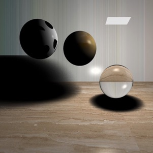
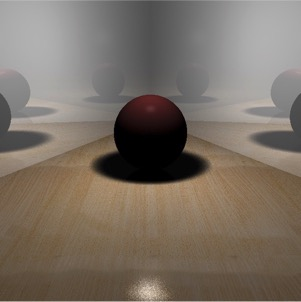

<head>
	<link href="../static/drcustom.css" rel="stylesheet" type="text/css">
</head>

<h2 class="P-title">DrRayTracer</h3>

<!--Overview-->
<h4 class="P-subtitle">Project Overview</h4>
A basic Raytracer implemented by me.

<ul class="P-list">
<li>Spring 2015</li>
<li>Tsinghua University</li>
<li>Developer</li>
</ul>
	
<!--Background-->
<h4 class="P-subtitle">Background</h4>
A Computer Graphic Project. The ray-tracer accomplished several functions:
<ul>
	<li>basic ray tracing (refracting, reflacting)</li>
	<li>soft shadow</li>
	<li>rectangle lighters</li>
	<li>textures</li>
	<li>anti-alias</li>
	<li>multi-threads</li>
	<li>depth of field</li>
	<li>random diffuse</li>
	<li>obj reader</li>
	<li>KD-tree</li>
</ul>

Code Repository: <a href="https://github.com/DrustZ/DrRayTracer">Github</a>

<!--IMAGES-->
<h4 class="P-subtitle">Images</h4>
<table class="P-galary" border="0" cellspacing="7px" cellpadding="5px" style="margin-left:auto;margin-right:auto;text-align:left">
<tr>
<td></td>
<td></td>
</tr>
<tr>
<td>Reflection and refraction</td>
<td>Soft shadow</td>
</tr>

<tr>
<td></td>
<td></td>
</tr>
<tr>
<td>Random diffuse</td>
<td>Depth of field</td>
</tr>
 
</table>

