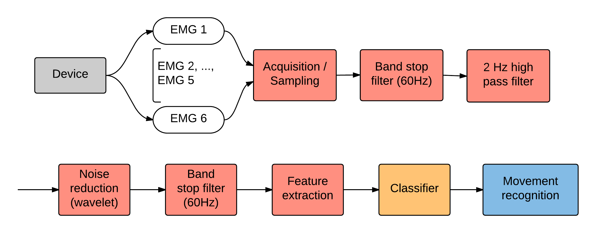
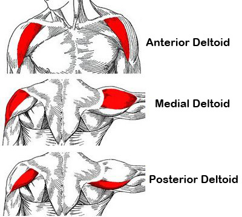
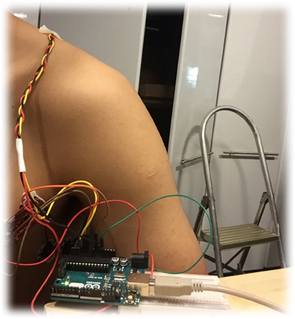
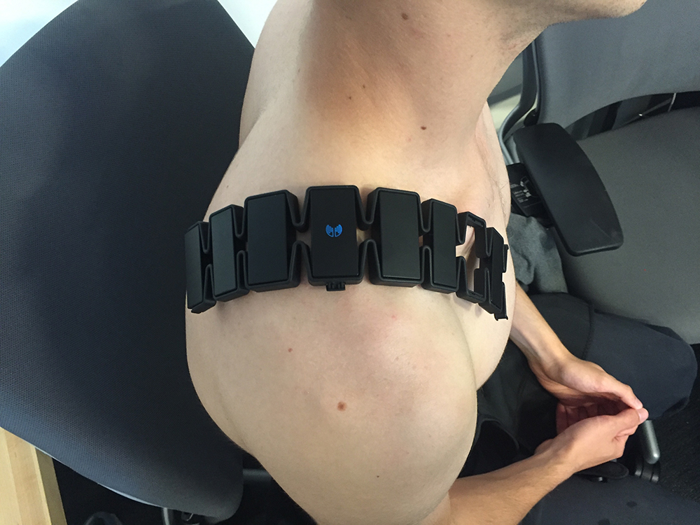

<head>
	<link href="../static/drcustom.css" rel="stylesheet" type="text/css">
</head>

<h2 class="P-title">Shoulder Interaction Device</h3>

<!--Overview-->
<h4 class="P-subtitle">Project Overview</h4>
Shoulder is the most flexible joint of human body while the interaction of shoulder is barely explored. To explore the possibility of Muscle-Computer interface(how natural could it be?), I made a sensing device to gather shoulders EMG signals using a Myo armband and recognize several gestures with machine learning. Then it transfer the gestures into control signals. 

<ul class="P-list">
<li>Summer 2016</li>
<li>Fluid Interfaces Group Media Lab, MIT</li>
<li>Together with <a href="https://www.hugomasclet.com/">Hugo</a> </li>
<li>Lead Developer &#38 Researcher</li>
</ul>

<!--Background-->
<h4 class="P-subtitle">Background</h4>
Many interaction tools like keyboard or touch screen separate us from the device we are interacting with. They make an artificial layer between human and computer. To explore what is a “natural” style, we made the shoulder controller. First, shoulder is the most flexible joint which is able to do many complex movements. Second, moving shoulders won’t interrupt other normal activities such as riding a bike. Thus it’s ideal for daily use.

<iframe class="P-iframe" src="https://docs.google.com/presentation/d/e/2PACX-1vRORCZs4xkWxwl16wxPII6r4ShKPUV-Iruyzjn6-lf-P1Gsvzbl5rjz3mAdqK89W_yLWqkQ3UOv7-Y2/embed?start=true&loop=true&delayms=5000" frameborder="0" width="750" height="450" allowfullscreen="true" mozallowfullscreen="true" webkitallowfullscreen="true"></iframe>

<!--Video-->
<h4 class="P-subtitle">Video</h4>
<iframe class="P-iframe" src="https://player.vimeo.com/video/192916158" width="640" height="480" frameborder="0" webkitallowfullscreen mozallowfullscreen allowfullscreen></iframe>

<!--IMAGES-->
<h4 class="P-subtitle">Images</h4>
<table class="P-galary" border="0" cellspacing="7px" cellpadding="5px" style="margin-left:auto;margin-right:auto;text-align:left">
<tr>
<td></td>
</tr>
<tr>
<td>Process Diagram</td>
</tr>
</table>

<table class="P-galary" border="0" cellspacing="7px" cellpadding="5px" style="margin-left:auto;margin-right:auto;text-align:left">
<tr>
<td></td>
<td></td>
</tr>
<tr>
<td>Mucles of Shoulder 1</td>
<td>Mucles of Shoulder 2</td>
</tr>
</table>

<table class="P-galary" border="0" cellspacing="7px" cellpadding="5px" style="margin-left:auto;margin-right:auto;text-align:left">
<tr>
<td></td>
<td></td>
</tr>
<tr>
<td>Early stage of using EMG MyroSensor</td>
<td>Test with Myo</td>
</tr> 
</table>

<table class="P-galary" border="0" cellspacing="7px" cellpadding="5px" style="margin-left:auto;margin-right:auto;text-align:left">
<tr>
<td></td>
<td></td>
</tr>
<tr>
<td>Set up of the device 1</td>
<td>Set up of the device 2</td>
</tr>
</table>

<table class="P-galary" border="0" cellspacing="7px" cellpadding="5px" style="margin-left:auto;margin-right:auto;text-align:left">
<tr>
<td></td>
</tr>
<tr>
<td>EMG signal of shoulder muscles</td>
</tr>
</table>

