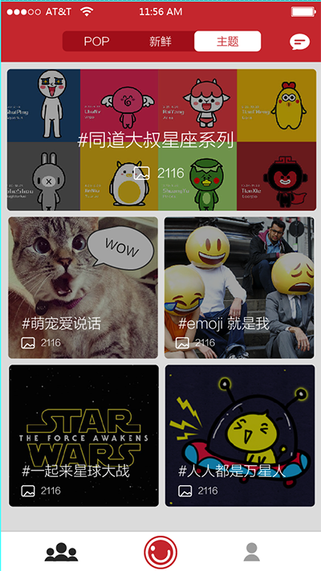
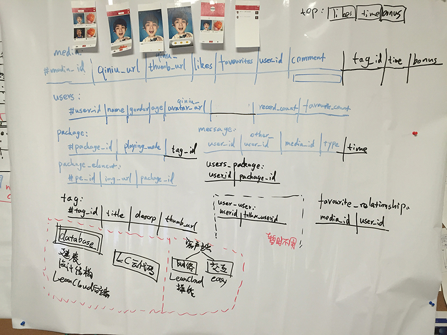
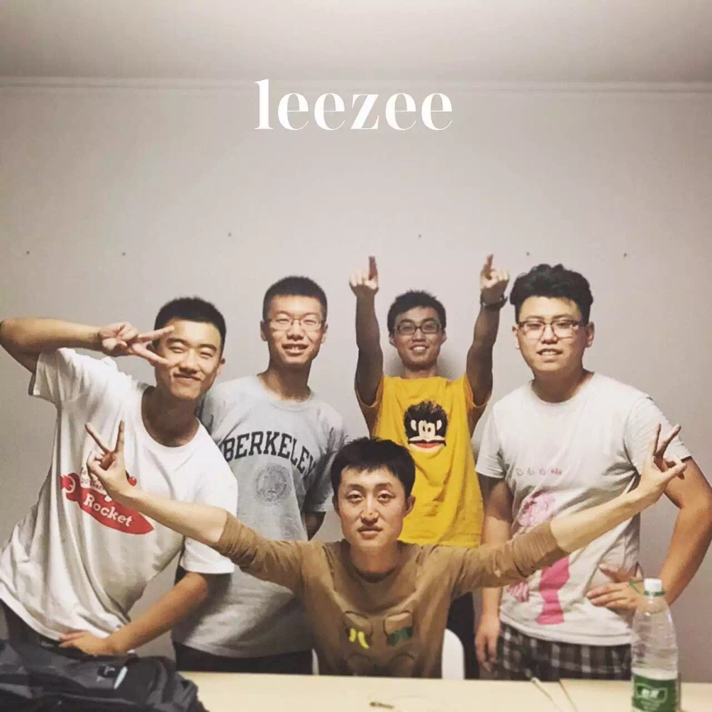

<head>
	<link href="../assets/css/drcustom.css" rel="stylesheet" type="text/css">
</head>

<h2 class="P-title">Parocam</h2>

<!--Overview-->
<h4 class="P-subtitle">Project Overview</h4>
Parocam is a funny iOS app transforming images of human faces (such as stretching the mouth) in real time, using multithread face-detection tech based on GPU. You can paste your mouth on the character's face, or make your eyes bigger.

<ul class="P-list">
<li>2014.10 – 2016.1</li>
<li>Leezee Tech Inc.</li>
<li>Together with <a href="http://vichengluo.me">Bicheng Luo</a> </li>
<li>Co-Founder &#38 Main iOS Developer</li>
</ul>

<!--Background-->
<h4 class="P-subtitle">Background</h4>
The application aims to make communication more intersting and joyful. It is funny to morph someone's face when watching their normal videos. Based on this ideas and collaborating with two friends, we made an iOS camera application that could automatically distort and morph human faces taken from the camera. I was in charge of developing and implementing face recognition algorithms using computer graphic methods. The App attracted investors and I co-founded Leezee software company.The application receives over 20,000 downloads in App Store (with overall rating 4+).  

Application website : <a href="http://www.parocam.com" target="_blank">www.parocam.com</a>

<iframe class="P-iframe" width="640" height="360" src="https://www.youtube.com/embed/nbDmSCga9WM" frameborder="0" allowfullscreen></iframe>

<!--Media Cover-->
<h4 class="P-subtitle">Media Cover</h4>
Mindstore collection: Parocam at a glance, 2015-04-15 <a href="http://www.ifanr.com/512258">[link]</a>

<!--IMAGES-->
<h4 class="P-subtitle">Images</h4>
<table class="P-galary" border="0" cellspacing="7px" cellpadding="5px" style="margin-left:auto;margin-right:auto;text-align:left">
<tr>
<td></td>
</tr>
<tr>
<td>Version 1 - UI &#39 Logic Design</td>
</tr>

<tr>
<td></td>
</tr>
<tr>
<td>Version 1.1 - UI &#39 Logic Design</td>
</tr>

<tr>
<td></td>
</tr>
<tr>
<td>Version 1.2 - Show Page</td>
</tr>

<tr>
<td></td>
</tr>
<tr>
<td>Version 1.3 - Tutorial Pages</td>
</tr>

<tr>
<td></td>
</tr>
<tr>
<td>Version 2.0 - Main Page, with online contents</td>
</tr>

<tr>
<td></td>
</tr>
<tr>
<td>Operation flow and database design for Vesrion 2.0</td>
</tr>

<tr>
<td></td>
</tr>
<tr>
<td>Team Members</td>
</tr>
</table>

