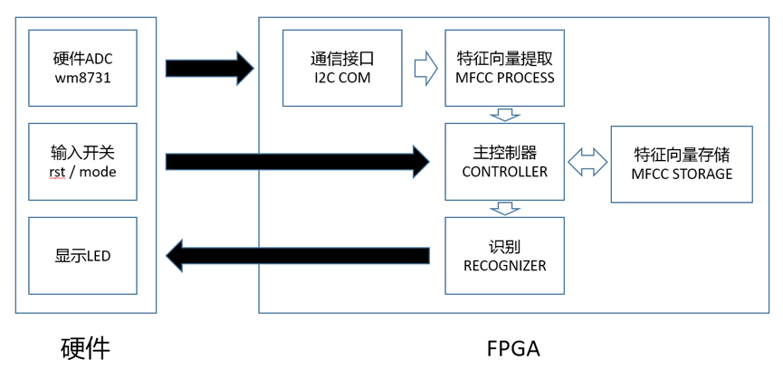
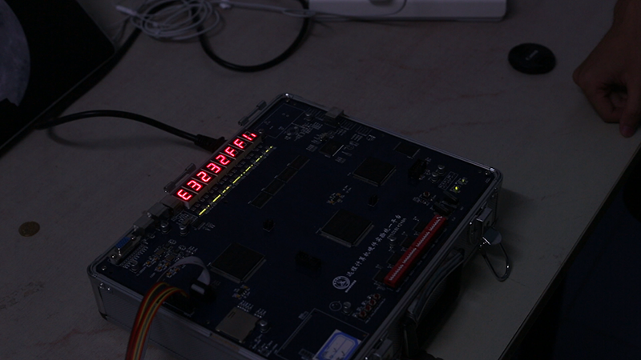

<head>
	<link href="../static/drcustom.css" rel="stylesheet" type="text/css">
</head>

<h2 class="P-title">VOICE++</h3>

<!--Overview-->
<h4 class="P-subtitle">Project Overview</h4>
Voice++ is a hardware platform that can recognize one’s voiceprint. MFCC voice recognition algorithm. It extracts different people's voice feature, and displays the result on LEDs.

<ul class="P-list">
<li>Spring 2015</li>
<li>Tsinghua University</li>
<li>Together with He Wen</li>
<li>Audio Chip Developer</li>
</ul>

<!--Background-->
<h4 class="P-subtitle">Background</h4>
Voice print, just like our fingerprint, is unique for different people. There are already lots of products recognizing voice print in software platform. Thus we implemented the first voice print recognition platform on hardware with FPGA and WM8731 Audio Chip. The Accuracy: 90% in two people, 75% in three people.

<iframe class="P-iframe" width="640" height="360" src="https://www.youtube.com/embed/5YTHiGeH6Ro" frameborder="0" allowfullscreen></iframe>

<!--IMAGES-->
<h4 class="P-subtitle">Images</h4>
<table class="P-galary" border="0" cellspacing="7px" cellpadding="5px" style="margin-left:auto;margin-right:auto;text-align:left">
<tr>
<td></td>
</tr>
<tr>
<td>System Architecture</td>
</tr>

<tr>
<td></td>
</tr>
<tr>
<td>Algorithm Flow</td>
</tr>

<tr>
<td></td>
</tr>
<tr>
<td>Realtime Test</td>
</tr>
 
</table>

